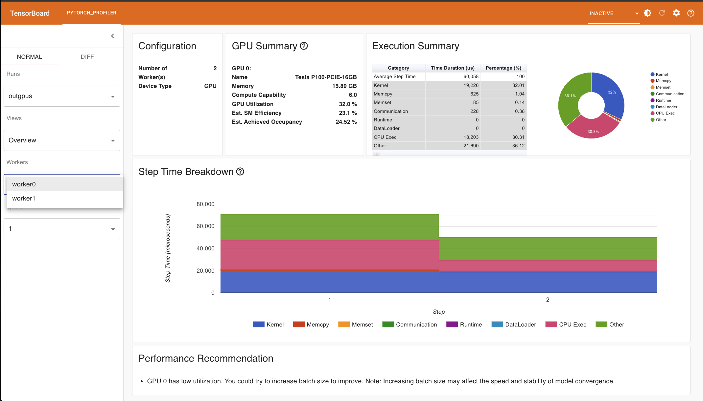

# Profiling a Resnet-18 model on Multiple GPUs

In some cases, your model may be too large, or the dataset you are working with might be so extensive that leveraging multiple GPUs becomes necessary to handle the workload efficiently. Running computations in parallel across multiple GPUs can significantly speed up training and improve performance.
This section explains how to extend the previous example of profiling a ResNet-18 model on a single GPU to a multi-GPU setup. We will use PyTorch's **Distributed Data Parallel (DDP)** module to distribute the workload across multiple GPUs. Additionally, we will utilize the PyTorch Profiler to collect and analyze performance metrics, just as we did for the single GPU case, but now in a multi-GPU environment.

## Code Example: Setting Up DDP for the ResNet-18 Model


````python
#import all the necessary libraries 
import os
import torch
import torch.nn as nn
import torch.optim
import torch.profiler
import torch.utils.data
import torchvision.datasets
import torchvision.models
import torchvision.transforms as T
from torchvision.models import ResNet18_Weights
from torch.distributed import init_process_group, destroy_process_group
from torch.nn.parallel import DistributedDataParallel as DDP
from torch.utils.data.distributed import DistributedSampler

def ddp_setup():
    init_process_group(backend="nccl")
    torch.cuda.set_device(int(os.environ["LOCAL_RANK"]))

def main():
    ddp_setup()
    rank = int(os.environ["LOCAL_RANK"])
    
    # Prepare data
    transform = T.Compose([
        T.Resize(256), 
        T.CenterCrop(224), 
        T.ToTensor(), 
        T.Normalize((0.5, 0.5, 0.5), (0.5, 0.5, 0.5))
    ])
    
    trainset = torchvision.datasets.CIFAR10(
        root='./data', 
        train=True, 
        download=True, 
        transform=transform
    )
    
    sampler = DistributedSampler(trainset, shuffle=True)
    trainloader = torch.utils.data.DataLoader(
        trainset, 
        batch_size=4,
        sampler=sampler,
        num_workers=2,
        pin_memory=True,
        persistent_workers=True
    )
    
    # Model setup
    device = torch.device(f"cuda:{rank}")
    model = torchvision.models.resnet18(weights=ResNet18_Weights.DEFAULT).to(device)
    model = DDP(model, device_ids=[rank])
    criterion = nn.CrossEntropyLoss().to(device)
    optimizer = torch.optim.SGD(model.parameters(), lr=0.001, momentum=0.9)
    model.train()
    
    prof = torch.profiler.profile(
      activities=[
        torch.profiler.ProfilerActivity.CPU,
        torch.profiler.ProfilerActivity.CUDA
      ],
      schedule=torch.profiler.schedule(wait=1, warmup=1, active=2),
      on_trace_ready=torch.profiler.tensorboard_trace_handler(f'./outgpus',
        worker_name=f'worker{rank}'
      ),
      record_shapes=True,
      profile_memory=True,
      with_stack=True
    )
    prof.start()

    for step, data in enumerate(trainloader):
      inputs, labels = data[0].to(device, non_blocking=True), data[1].to(device, non_blocking=True)
    
      outputs = model(inputs)
      loss = criterion(outputs, labels)
    
      optimizer.zero_grad(set_to_none=True)
      loss.backward()
      optimizer.step()
    
      prof.step()
      print(f"Rank {rank} - step: {step}, loss: {loss.item():.4f}")

    
      if step >= 10:
        break

    prof.stop()
    
    destroy_process_group()

if __name__ == "__main__":
    main()
````


## Understanding the DDP setup

To enable DDP in our code, we made several modifications to the previous implementation. DDP is a PyTorch module that allows us to parallelize our model across multiple GPUs or even multiple machines. You can learn more about DDP in the [official PyTorch DDP tutorial](https://docs.pytorch.org/tutorials/intermediate/ddp_tutorial.html). Additionally, if you are looking for an example of setting up DDP for our cluster, refer to this project: [DDP Example on Saga](https://github.com/beenodbaneeya/Distributed-Pytorch/tree/main).

### Key Changes in the Code
1. **Wrapping the Main Logic**:
The main logic of the code has been encapsulated in a function. This is a common practice when working with DDP to ensure proper initialization and cleanup of distributed processes.


2. **Data Loading Optimizations**: 
- We added `persistent_workers=True` to the `DataLoader` to improve performance by keeping worker processes alive between iterations.
- We also set `non_blocking=True` for data transfers to overlap data transfer with computation, further optimizing the data loading process.

3. **Memory Efficiency**:  
To reduce memory usage, we configured the optimizer with `optimizer.zero_grad(set_to_none=True)`. This ensures gradients are set to `None` instead of zeroing them out, which can save memory during training.


4. **Profiling Across Multiple GPUs**:  
- Since we are using multiple GPUs, the profiling code now collects metrics from all GPUs. This allows us to analyze the performance of the entire distributed setup.  
- However, if you want to profile a specific GPU, you can modify the code to log metrics only for that GPU. For example, by adding a condition like `if rank == 0:`, you can restrict profiling to a single GPU (typically GPU 0).  
- While it is possible to profile all GPUs during testing, in practice, profiling is often limited to a single GPU to reduce profiling overhead once the setup is verified.


## Job Script for Utilizing Multiple GPUs

To run our code on multiple GPUs, we need to make a few modifications to the previous job script. These changes ensure that the script is configured to utilize multiple GPUs effectively and include PyTorch-specific parameters required for distributed training.
For example, we use the `torchrun` utility with the `standalone` argument to indicate that the code will run on multiple GPUs within a single node. This is a key step in enabling PyTorch's DDP functionality.
Below is the updated job script with the necessary changes for multi-GPU execution.


````bash
#!/bin/bash -l
#SBATCH --job-name=PyTprofilergpus
#SBATCH --account=<project_number>
#SBATCH --time=00:10:00     #wall-time 
#SBATCH --partition=accel   #partition 
#SBATCH --nodes=1           #nbr of nodes
#SBATCH --ntasks=1          #nbr of tasks
#SBATCH --ntasks-per-node=1 #nbr of tasks per nodes (nbr of cpu-cores, MPI-processes)
#SBATCH --cpus-per-task=1   #nbr of threads
#SBATCH --gpus=2            #total nbr of gpus
#SBATCH --mem=4G            #main memory
#SBATCH -o PyTprofilergpus.out  #slurm output 

# Set up job environment
set -o errexit # exit on any error
set -o nounset # treat unset variables as error

#define paths
Mydir=/cluster/work/users/<user_name>
MyContainer=${Mydir}/Container/pytorch_22.12-py3.sif
MyExp=${Mydir}/MyEx

#specify bind paths by setting the environment variable
#export SINGULARITY_BIND="${MyExp},$PWD"

#TF32 is enabled by default in the NVIDIA NGC TensorFlow and PyTorch containers 
#To disable TF32 set the environment variable to 0
#export NVIDIA_TF32_OVERRIDE=0

#to run singularity container 
srun singularity exec --nv -B ${MyExp},$PWD ${MyContainer} torchrun --standalone --nnodes=1 --nproc_per_node=${SLURM_GPUS_PER_NODE:-2} ${MyExp}/resnet18_api_ddp.py

echo 
echo "--Job ID:" $SLURM_JOB_ID
echo "--total nbr of gpus" $SLURM_GPUS
echo "--nbr of gpus_per_node" $SLURM_GPUS_PER_NODE
````


# Performance Metrics 

In this section, we present screenshots of various performance metrics captured using the PyTorch Profiler. These metrics provide insights into GPU-specific logs and help us analyze the performance of our multi-GPU setup.

## 1. GPU Usage

When profiling performance metrics for multiple GPUs, the TensorBoard dashboard allows us to select and view the metrics for each GPU individually. For example, as shown in the figure below, we can analyze the GPU utilization for each GPU in the system:

The dashboard provides detailed information, including GPU utilization for each GPU. In our case, both GPUs are utilized at approximately **33%**, and the profiler also provides performance recommendations for both GPUs. These insights are valuable for identifying bottlenecks and optimizing GPU usage in a distributed training setup.

## 2. Trace View

Similar to the single GPU case, we can now view the trace for each individual GPU in a multi-GPU setup. The trace view provides a detailed timeline of operations, helping us identify potential bottlenecks for each GPU.
As shown in the figure below, the trace view allows us to analyze the execution patterns and performance of each GPU:

This visualization is particularly useful for pinpointing inefficiencies and understanding how workloads are distributed across GPUs in a distributed training setup.

## 3. Memory View
The **Memory View** allows us to compare the memory usage of each GPU over time. This view provides valuable insights into how memory is allocated and utilized by each GPU during training.
By analyzing the memory usage across different timeframes for individual GPUs, we can identify potential inefficiencies and determine whether any optimizations are needed to improve memory utilization.
Below are the memory views for the two GPUs used in our setup:
- **Memory View for GPU 0**:  
  
- **Memory View for GPU 1**:  
  

These visualizations help us monitor and compare memory usage across GPUs, making it easier to identify imbalances or areas for improvement.

## 4. Distributed View

The **Distributed View** provides detailed information about the devices used in the multi-GPU setup. This includes details such as the device name, memory usage, and other relevant metrics for each GPU.
As shown in the figure below, this view helps us understand the hardware configuration and resource utilization for each GPU:

Additionally, the **Distributed View** offers an overview of computation and synchronization across GPUs in a graphical format. This visualization is particularly useful for analyzing how workloads are distributed and synchronized between GPUs, helping us identify potential inefficiencies in the distributed training


