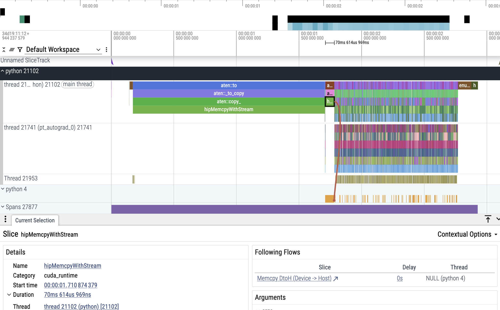
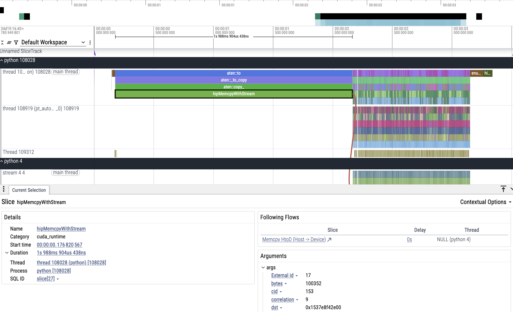
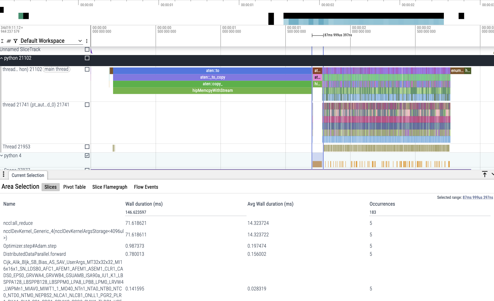
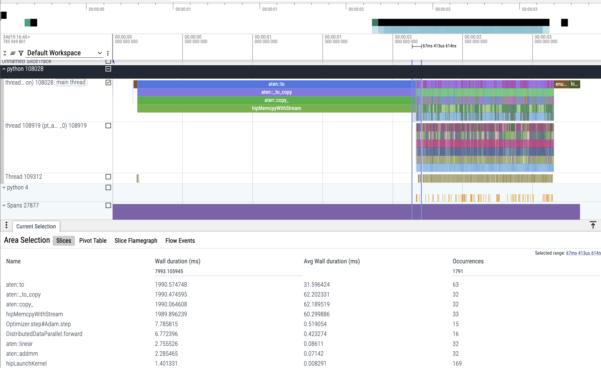
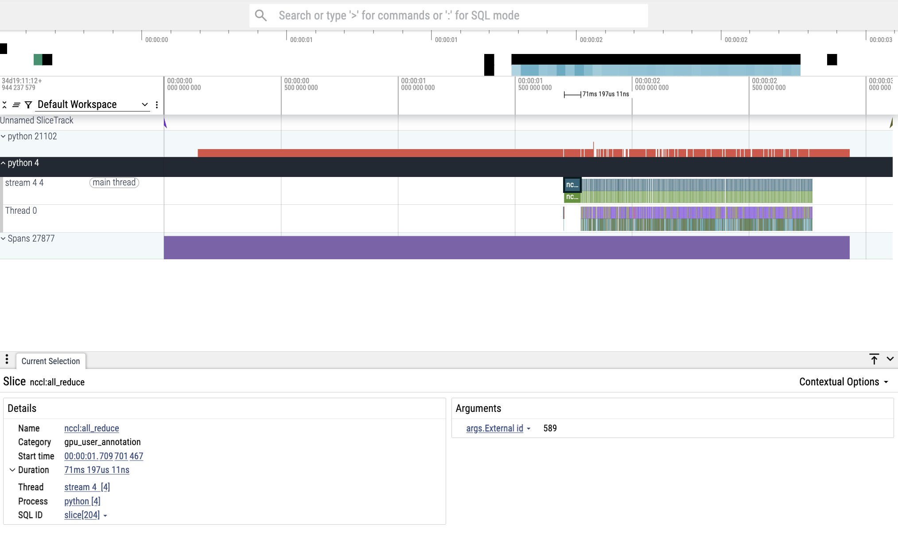
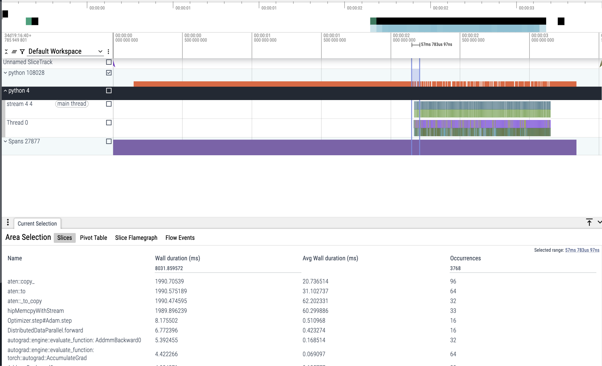

# Using Perfetto to Identify DDP Training Bottlenecks

This project demonstrates how to detect performance bottlenecks in PyTorch Distributed Data Parallel (DDP) training using Perfetto. We focus on how the DataLoader’s num_workers parameter impacts pipeline efficiency.

## Experiment Overview

In this study, we analyze the impact of PyTorch’s DataLoader num_workers parameter on training performance using Perfetto. By comparing two configurations: `num_workers=0` (serial data loading) and `num_workers=4` (parallel prefetching), we demonstrate how Perfetto visually exposes bottlenecks. With `num_workers=0`, traces reveal GPU starvation during blocking main-thread data transfers, seen as gaps between CUDA kernels and prolonged NCCL synchronization. Conversely, `num_workers=4` shows efficient pipeline utilization: overlapping CPU data loading and GPU computation, continuous kernel execution, and faster DDP gradient syncs. These traces serve as a practical guide to validate data-loading optimization strategies in distributed training.

Perfetto traces can appear complex intially. We will analyze CPU Threads, GPU Streams and Key Operations like `hipMemcpyWithStream` for data transfers and `ncclAll_reduce` for DDP synchronization.

For easy comparison we will name `ZeroWorkers` for  traces with inefficient (num_workers=0) runs and `FourWorkers` for traces with optimized (num_workers=4) runs.

## Comparing Traces: num_workers=0 vs num_workers=4

The Perfetto traces reveal stark differences between serial and parallel data loading configurations. With num_workers=0, the screenshot shown here shows a 70ms hipMemcpyWithStream operation which a CUDA memory copy that forces sequential execution.

 Here, the main Python thread handles both data loading and transfers, creating visible yellow gaps in the timeline where the GPU sits idle, waiting for data. These periodic 70ms stalls break computation into disjointed chunks, confirming a CPU-bound bottleneck. Since no worker threads prefetch data, the pipeline alternates between loading (CPU-bound) and processing (GPU-bound), never achieving overlap.

In contrast, the num_workers=4 trace exhibits continuous activity as shown in this screenshot.

The same hipMemcpyWithStream operations now run concurrently with GPU kernels, evidenced by the absence of yellow idle gaps. Parallel worker threads prefetch data in the background, ensuring the GPU receives a steady stream of batches. This eliminates the 70ms stalls seen earlier, allowing DDP to maintain full GPU utilization. The key takeaway is here is that, insufficient worker threads serialize the pipeline, while parallel prefetching enables true CPU-GPU parallelism.

## Detailed Trace Analysis: Data Transfer and GPU Execution

1. Serial Data Loading (num_workers=0)

As shown in this screenshot  , the sliced traces reveals the critical bottlenecks in the pre-GPU copy phase.The `ncclALL_reduce` operations which took 71.61 ms dominate the timeline, showing DDP´s gradient synchronization stalled by CPU-bound data loading. This serialization forces GPUs to wait for ready gradients, creating a chain of delays.The `Short-duration GEMM kernels` i.e. (0.14ms for Cijk_Afix_Bijk_SB...) indicate fragmented GPU utilization. The GPU processes small, irregular batches due to intermittent data availability.
The Adam optimizer (0.98ms step time) confirms computations themselves are fast and the bottleneck lies in the pipeline serialization.The sequential workflow for data load, NCCL Sync and GPU kernels without overlap between steps shows how single-threaded loading affects DDP efficiency.

2. Parallel Prefetching (num_workers=4)

As shown in this screenshot  , overlapping operations `hipMemcpyWithStream` now runs concurrently with GEMM kernels (e.g., aten::addmm), which shows the simultaneous CPU/GPU activity. The DDP syncs are ten times faster i.e. (0.42ms vs 71.61ms) as the workers prefetch data before gradients are needed. Furthermore, the consistent kernel durations (0.07–0.08ms) reflect uniform batch processing, enabled by non-blocking data flows. The pipeline saturation with 1791 total operations confirms full GPU utilization where the parallel worker transforms DDP from a serialized chain into a continuous pipeline where the data preparation and the compute scale together.

## GPU Stream Analysis: Visualizing Pipeline Efficiency

1. Serialized Workflow (num_workers=0)

The GPU stream trace as shown in this screenshot  reveals the critical inefficiencies. A dominant `ncclAll_reduce` operation (gradient synchronization in DDP) appears before GPU computation begins, indicating the GPU is idle while waiting for data. This confirms that there is a CPU-to-GPU transfers block execution and No compute/copy overlap. It shows that without prefetching, GPUs starve for data even in multi-GPU setups.

2. Parallelized Workflow (num_workers=4)

The optimized trace as shown in this screenshot shows resolved bottlenecks.  Concurrent `hipMemcpyWithStream` and GPU ops where memory copies are now overlap with `autograd.engine` and `Optimizer.step` can be verified by interleaved CPU/GPU activities in the timeline.Gradient syncs happen during compute phases, as workers prefetch data in advance and hence there is no standalone `ncclAll_reduce` stalls.  Hence, we can see the immediate  GPU utilization where the computation starts without delays proving the data is ready when needed.

## Conclusion: 

Profiling GPU streams in Perfetto helps identify: Inefficient scheduling and optimal overlap.Even "working" DDP implementations may hide subtler bottlenecks (e.g., uneven GPU utilization). So it is recommended to profile to validate true pipeline efficiency always.