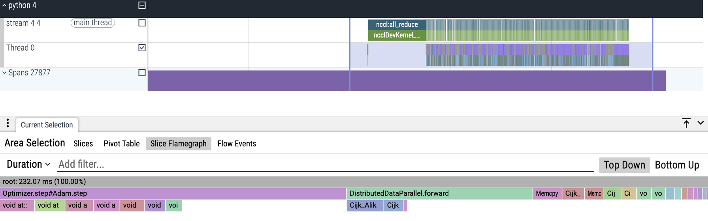

# Using Perfetto to Identify DDP Training Bottlenecks

This project demonstrates how to detect performance bottlenecks in PyTorch Distributed Data Parallel (DDP) training using Perfetto. We focus on how the DataLoader’s num_workers parameter impacts pipeline efficiency.

## Experiment Overview

In this study, we analyze the impact of PyTorch’s DataLoader num_workers parameter on training performance using Perfetto. By comparing two configurations: `num_workers=0` (serial data loading) and `num_workers=4` (parallel prefetching), we demonstrate how Perfetto visually exposes bottlenecks. With `num_workers=0`, traces reveal GPU starvation during blocking main-thread data transfers, seen as gaps between CUDA kernels and prolonged NCCL synchronization. Conversely, `num_workers=4` shows efficient pipeline utilization: overlapping CPU data loading and GPU computation, continuous kernel execution, and faster DDP gradient syncs. These traces serve as a practical guide to validate data-loading optimization strategies in distributed training.

Perfetto traces can appear complex intially. We will analyze DataLoader Performance, GPU Streams and Slice Flamegraph for the Main thread.

## Detailed trace analysis: Differences in  DataLoader Performance(0 vs 4 worker)
The performance differences between using 0 workers and 4 workers in the DataLoader are evident from the trace data. For the 0 worker configuration, the total wall duration measured approximately `1.77` seconds as shown in this screenshot , while the 4 worker configuration showed a longer duration of about `6.42` seconds in this corresponding screenshot . This increased duration for 4 workers reflects greater parallel batch processing, resulting in more total work being captured within the trace period. The DataLoader implementation differs significantly between these configurations - the 4 worker setup utilizes multiple processors to parallelize the workload, whereas the 0 worker case relies on a single processor handling all operations sequentially.

A critical difference appears in the `enumerate[DataLoader]` operation timing, where the 0 worker case required `802` milliseconds compared to just `134` milliseconds for 4 workers, demonstrating 6x improvement. This confirms that with 0 workers, the main thread becomes blocked during data loading, starving the GPU of work, while the 4 worker configuration eliminates this bottleneck through efficient workload distribution. GPU utilization metrics further validate these findings: the `hipLaunchKernel` calls increased from `2,520` with 0 workers to `9,849` with 4 workers (a 3.9× improvement), and backward passes grew from `240` to `938` operations (4× more). These measurements clearly demonstrate superior GPU utilization and throughput when using 4 workers compared to the single-threaded 0 worker configuration.

## GPU Stream Analysis: Visualizing Pipeline Efficiency

The GPU utilization patterns show significant differences between the configurations. For the num_workers=0 case as shown in the this screenshot , the GPU stream completed operations in just `107.54` ms total duration, while the num_workers=4 configuration as shown in the this screenshot  required `693.78` ms - approximately `6.45` times longer. This increased duration actually reflects improved throughput, as the system processes more work. The short duration with 0 workers indicates GPU underutilization, where the device frequently waited for CPU-side operations, while the extended active period with 4 workers demonstrates continuous GPU utilization without starvation.

The operation counts further confirm this advantage. With 4 workers, the trace captured `469` occurrences of `nccl:all_reduce` operations compared to only `119` occurrences with 0 workers. This `3.94×` increase in collective operations verifies that significantly more batches were processed within the observed timeframe when using worker parallelism. The GPU kernels show a corresponding increase from `119` to `469` executions, maintaining the same ratio and confirming balanced scaling between computation and communication.

## Slice Flamegraph for the Main thread (i.e. Thread 0)
The analysis reveals clear differences in main thread behavior between the configurations. For `num_workers=0` as shown in this screenshot , the total duration was `42.66` ms, while `num_workers=4` as shown in this  screenshot  required `232.07` ms - approximately `5.4` times longer duration. This increased duration represents greater productive work being accomplished rather than inefficiency.

The flamegraph patterns show fundamentally different execution characteristics. With 0 workers, all operations appear crammed together in chaotic interleaving - CUDA API calls (void at...), GPU kernels (Cijk_AIk...), and memory transfers (Memory HbD) compete for main thread attention. This indicates constant task switching and failed pipelining, where most of time is lost to overhead with only less time spent on actual computation.

In contrast, the 4 worker case demonstrates an organized pipeline with clean separation: optimizer steps (CPU), DDP forward passes (coordination), and GPU kernels execute in sequential phases. The visible gaps between GPU kernel calls during DDP operations represent efficient synchronization points rather than bottlenecks. This structured approach enables more amount of time to be spent on productive work, with workers maintaining continuous GPU feeding by handling Python-side operations separately from the main thread's C++/CUDA critical path.

## Conclusion: 

Profiling GPU streams in Perfetto helps identify: Inefficient scheduling and optimal overlap.Even "working" DDP implementations may hide subtler bottlenecks (e.g., uneven GPU utilization). So it is recommended to profile to validate true pipeline efficiency always.

