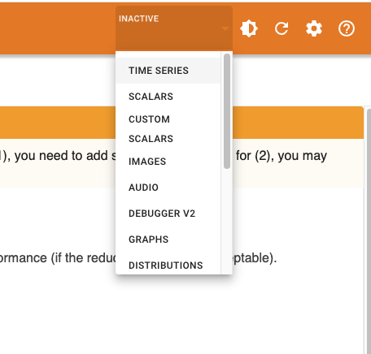
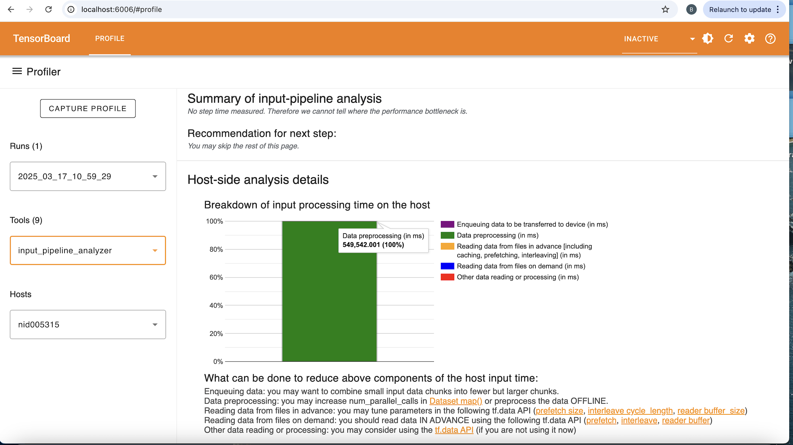
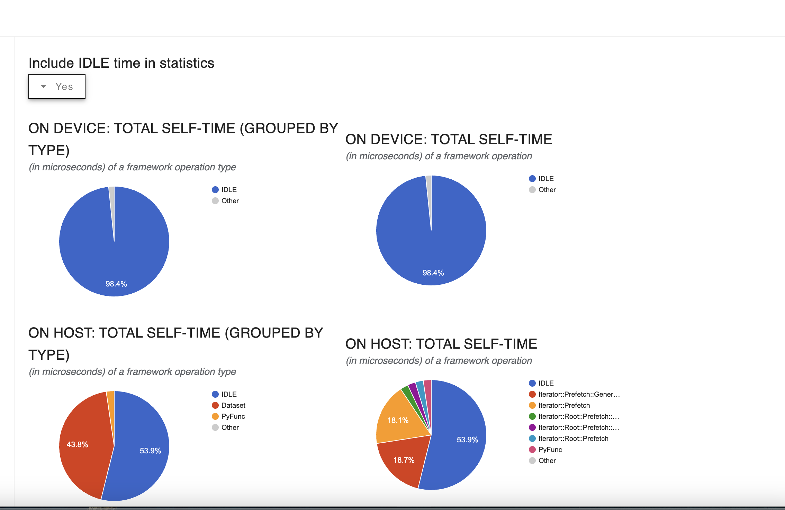
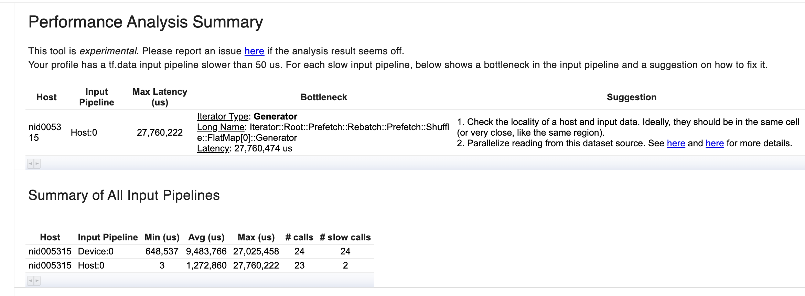

# Visualizing the traces with the tensorboard.
If TensorFlow is installed on your cluster, you can use TensorBoard to profile GPU usage. For more details on how to profile GPU performance, refer to the documentation [Optimize TensorFlow performance using the profiler](https://www.tensorflow.org/guide/profiler). In this tutorial, we will explore how to visualize TensorFlow logs on a local machine and learn about various aspects of TensorBoard.

To view TensorFlow logs locally, you need to install the TensorFlow Profiler. However, if you're using a macOS system, installing TensorFlow with GPU support can be challenging due to compatibility issues. To simplify the process, we will install TensorFlow without GPU support. This approach allows you to view the logs on your local machine, regardless of the GPU-specific setup used to generate the logs.

Once the logs are generated on the GPU-enabled machine, you can copy them to your local machine for visualization. To get started, you can create a `requirements.txt` file as shown below:

````bash
absl-py==2.1.0
astunparse==1.6.3
certifi==2025.1.31
charset-normalizer==3.4.1
etils==1.12.0
flatbuffers==25.2.10
fsspec==2025.2.0
gast==0.6.0
google-pasta==0.2.0
grpcio==1.70.0
gviz-api==1.10.0
h5py==3.13.0
idna==3.10
importlib_resources==6.5.2
keras==3.9.0
libclang==18.1.1
Markdown==3.7
markdown-it-py==3.0.0
MarkupSafe==3.0.2
mdurl==0.1.2
ml-dtypes==0.4.1
namex==0.0.8
numpy==2.0.2
opt_einsum==3.4.0
optree==0.14.1
packaging==24.2
protobuf==4.25.6
Pygments==2.19.1
requests==2.32.3
rich==13.9.4
setuptools==75.8.2
six==1.17.0
tensorboard==2.18.0
tensorboard-data-server==0.7.2
tensorboard-plugin-profile==2.18.0
tensorflow==2.18.0
termcolor==2.5.0
typing_extensions==4.12.2
urllib3==2.3.0
Werkzeug==3.1.3
wheel==0.45.1
wrapt==1.17.2
zipp==3.21.0
````

Create the following directory structure: `/profile_logs/plugins/profile`.
Place the actual logs you want to profile inside the `profile` directory.


## Intorduction to tensorboard
TensorBoard is a powerful tool that helps debug issues with neural networks. It is also useful for tracking and visualizing metrics such as loss and accuracy. Since TensorBoard is included with TensorFlow, there’s no need for a separate installation.

Let’s consider a scenario where you want to experiment with different training parameters. For example, instead of using the Adam optimizer, you might switch to SGD. This change could affect the loss and behavior of your neural network. If you're training for thousands of epochs, manually analyzing these metrics would be tedious. TensorBoard simplifies this process by providing a clear visualization of your training progress. It allows you to easily track how accuracy improves and how losses decrease over time using intuitive graphs.

You can record the training process by using the TensorBoard callback. Simply add the following code before your training code.
`tb_callback = tf.keras.callbacks.TensorBoard(log_dir="logs/, histogram_freq=1)` 


After adding this line of code, you can pass the callback to the `model.fit` method as shown below:
````bash
model.fit(X_train, y_train, epochs=5, callbacks=[tb_callback])
````
Here, X_train and y_train represent your training and test datasets. During training, TensorFlow will use the callback to log information such as loss, accuracy, and other metrics for each epoch. These details will be recorded in the specified log directory via tb_callback.


### Running TensorBoard on a Local Machine
To run TensorBoard on your local machine, you can set up a separate virtual environment and install the necessary software listed in the `requirements.txt` file. Follow these steps:

1. Create a Virtual Environment:
Create a virtual environment and activate it using the following command:

`source myenv/bin/activate`

2. Install Required Packages:
Inside the virtual environment, install all the required packages for TensorBoard by running:

`pip install -r requirements.txt`

3. Launch TensorBoard:

Once the packages are installed, you can launch TensorBoard with the following command:

`tensorboard --logdir profile_logs/ --load`

This will start TensorBoard and allow you to visualize your logs.

### Running TensorBoard Directly from Jupyter Notebook
If you're working in a Jupyter Notebook, you can launch TensorBoard directly within the notebook. Use the following command to start TensorBoard. It will function the same way as running it on a local machine but will display the interface at the bottom of your Jupyter Notebook.


````bash
%load_ext tensorboard
%tensorboard --logdir logs/fit
````

`%load_ext tensorboard` loads the Jupyter TensorBoard extension and `%tensorboard --logdir logs/fit` starts TensorBoard and shows the UI in the notebook, reading logs from logs/fit.


### Extracting information from TensorBoard

TensorBoard provides valuable insights into your model's performance and structure. To view metrics such as loss and accuracy at each step, you can select the Scalars tab from the top-right menu as shown in the image below . 

 This will display a graphical representation of how the loss decreases and accuracy improves over time. Additionally, you can explore the `Graph tab`, which visualizes the internal structure of your neural network. For instance, you can observe how a 28x28 image is flattened into a 784-dimensional array and passed into a dense network. Furthermore, the `Histogram` tab allows you to analyze the frequency distribution of your model's weights, offering deeper insights into the training process. These tools make TensorBoard an essential resource for understanding and debugging your neural network.

Using TensorBoard, you can create two separate log directories to store results for different hyperparameters, such as using the Adam optimizer versus SGD. This makes it easier to visually compare the performance of both optimizers and evaluate their effectiveness.


In addition, the TensorBoard Profiler can help identify specific problem areas in your code. For instance, it can highlight issues within the data input pipeline, which is explained in detail in the [Data input pipelines](https://www.tensorflow.org/guide/data)  guide. Below are some screenshots with explanations, demonstrating how TensorBoard indicates problems in the input pipeline.


1. Input Pipeline Analyzer:

Within the tools menu (as shown in the image below), you can select the input_pipeline_analyzer:
, This tool provides insights into the time spent on data preprocessing, helping you identify potential bottlenecks in your input pipeline.

2. Framework Op Stats

Similarly, by selecting the `framework_op_stats` tool, you can view a detailed breakdown of operations. For example, after enabling the option Include IDLE time in statistics, you will see a visualization like this:  

This tool is particularly useful for analyzing GPU usage, as it highlights idle time on the device. In the screenshot above, it is evident that the GPU was idle for most of the time. Additionally, the tool provides insights into the time spent on different operation types on the host. For instance, minimal time was spent on Python functions, while a significant portion was allocated to Dataset operations.


3. TF Data Bottleneck Analysis:

By selecting the tf_data_bottleneck_analysis tool, you can view a summary of the input pipelines. For example, in the image below: It is evident that a significant amount of time was spent on data preprocessing. This analysis helps identify bottlenecks in the input pipeline, enabling you to optimize performance effectively.


In summary, TensorBoard is an invaluable tool for visualizing metrics such as loss and accuracy, as well as identifying potential issues in your workflow. It is highly recommended to use TensorBoard when working with TensorFlow in your projects.